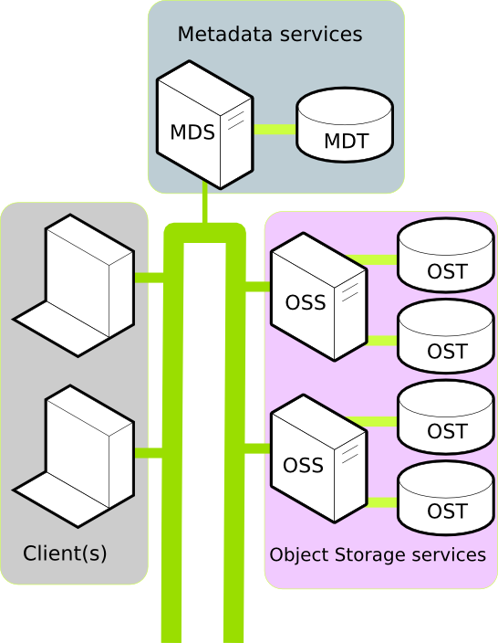

# Lustre deployment demo

This is a simple ansible playbook to configure a cluster of VMs for Lustre. It is more a practical documentation than a fully fledged playbook.



The architecture that this playbook deploys is composed of:
- One MGS/MDT server with one 1GB MGT/MDT volume attached
- One MDS server with one 1GB MDT volume attached
- Two OSS servers, each with four 16GB OST volumes attached
- Two clients

A small jump host VM needs to be present in order to access the VMs by SSH.  

The ansible script will be launched from your local machine, you need to edit `~/.ssh/config` to add the jumphost and the different VMs that will be deployed.  
Here is an example. The names of the VMs come from the ansible script, it can be different if you decide to change the names:

```
Host jumphost
    user {replace_me} # If your jumphost is Ubuntu: ubuntu else if it's AlmaLinux: almalinux
    hostname {Floating_ip}

Host lustre-client-1
    Hostname {internal_VM_IP}
    user almalinux
    proxyjump jumphost

Host lustre-client-2
    Hostname {internal_VM_IP}
    user almalinux
    proxyjump jumphost

Host lustre-oss-1
    Hostname {internal_VM_IP}
    user almalinux
    proxyjump jumphost

Host lustre-oss-2
    Hostname {internal_VM_IP}
    user almalinux
    proxyjump jumphost

Host lustre-mds
    Hostname {internal_VM_IP}
    user almalinux
    proxyjump jumphost

Host lustre-mgs-mds
    Hostname {internal_VM_IP}
    user almalinux
    proxyjump jumphost
```

Here are the definitions of each nodes from our [documentation](https://docs.csc.fi/computing/lustre/):

- **Object Storage Servers (OSSs)**: They handle requests from the clients in order to access the storage. Moreover, they manage a set of OSTs; each OSS can have more than one OST to improve the I/O parallelism.
- **Object Storage Targets (OSTs)**: Usually, an OST consists of a block of storage devices under RAID configuration. The data is stored in one or more objects, and each object is stored on a separate OST.
- **Metadata Server (MDS)**: A server that tracks the locations for all the data so it can decide which OSS and OST will be used. For example, once a file is opened, the MDS is not involved any more.
- **Metadata Target (MDT)**: The storage contains information about the files and directories such as file sizes, permissions, access dates. For each file MDT includes information about the layout of data in the OSTs such as the OST numbers and object identifiers.


# Deploy

The prerequisites are installed like this:

```sh
$ ansible-galaxy install -r requirements.yaml 

$ source <openrc.sh file>
Please enter your OpenStack Password for project project_XXXX as user YYYYYYYY:
```

Be sure to have [openstacksdk](https://pypi.org/project/openstacksdk/) >= 1.0 installed.  
Then to create the VMs, call ansible:

```sh
$ ansible-playbook main.yml
```

It will ask you some information:  
**Key name?**: The name of the cPouta key pairs.  
**Network?**: The name of the network used in cPouta. Usually, it's the project name (project_xxxxxx)  
**Jump Host IP?**: The Floating IP of your jump host in cPouta. Don't forget to assign one.  

All Lustre elements will be installed on Almalinux 8.

# Explanations

This ansible example is made for two OSS instances. So far, if you want more OSS instances, there are some points to consider:

- in `create_lustre_oss.yaml` file, there is the section `## Volumes`:
```yaml
## Volumes
- name: Calculate number of volumes
  set_fact:
    number_volumes: "{{ number_lustre_oss_instances * 4 }}"

[...]

## Attach volumes
- name: Attach the volumes to the first instance
  openstack.cloud.server_volume:
    state: present
    server: "{{ instances.results[0].item }}"
    volume: "{{ volumes.results[item].item }}"
  loop:
    - 0
    - 1
    - 2
    - 3

- name: Attach the volumes to the second instance
  openstack.cloud.server_volume:
    state: present
    server: "{{ instances.results[1].item }}"
    volume: "{{ volumes.results[item].item }}"
  loop:
    - 4
    - 5
    - 6
    - 7
```

The number of the volumes is calculate regarding the number of instances. In this example 8 ( 2 instances x 4 ).  
So, it will attach 4 volumes on 2 instances. If you change the number of instances, you have to add new lines in this code and modify `server` and `loop`.  
If you decide to have three OSS instances, edit the code to be like:
```yaml
## Attach volumes
- name: Attach the volumes to the first instance
  openstack.cloud.server_volume:
    state: present
    server: "{{ instances.results[0].item }}"
    volume: "{{ volumes.results[item].item }}"
  loop:
    - 0
    - 1
    - 2
    - 3

- name: Attach the volumes to the second instance
  openstack.cloud.server_volume:
    state: present
    server: "{{ instances.results[1].item }}"
    volume: "{{ volumes.results[item].item }}"
  loop:
    - 4
    - 5
    - 6
    - 7

## NEW
- name: Attach the volumes to the third instance
  openstack.cloud.server_volume:
    state: present
    server: "{{ instances.results[2].item }}"
    volume: "{{ volumes.results[item].item }}"
  loop:
    - 8
    - 9
    - 10
    - 11
##
```

Since you have a new OSS instance, you have to add a new section in the `main.yaml` file:
```yaml
- name: Configure OSS Volumes
  hosts: oss-1 # Edit the name if you have change the name in all.yaml
  gather_facts: false
  become: true
  roles:
  - oss-1_volumes

- name: Configure OSS Volumes
  hosts: oss-2 # Edit the name if you have change the name in all.yaml
  gather_facts: false
  become: true
  roles:
  - oss-2_volumes

## NEW
- name: Configure OSS Volumes
  hosts: oss-3 # Edit the name if you have change the name in all.yaml
  gather_facts: false
  become: true
  roles:
  - oss-3_volumes
##
```

And copy the folder `oss-2_volumes` to have `oss-3_volumes`.  
Edit the indexes in `vars` in `Create a lustre filesystem` and `Mount lustre`:
```yaml
[...]
  vars:
    devices:
      - devicename: b
        index: '8'
      - devicename: c
        index: '9'
      - devicename: d
        index: '10'
      - devicename: e
        index: '11'
[...]
```

*Check your quota to see if you can create enough instances and volumes*
